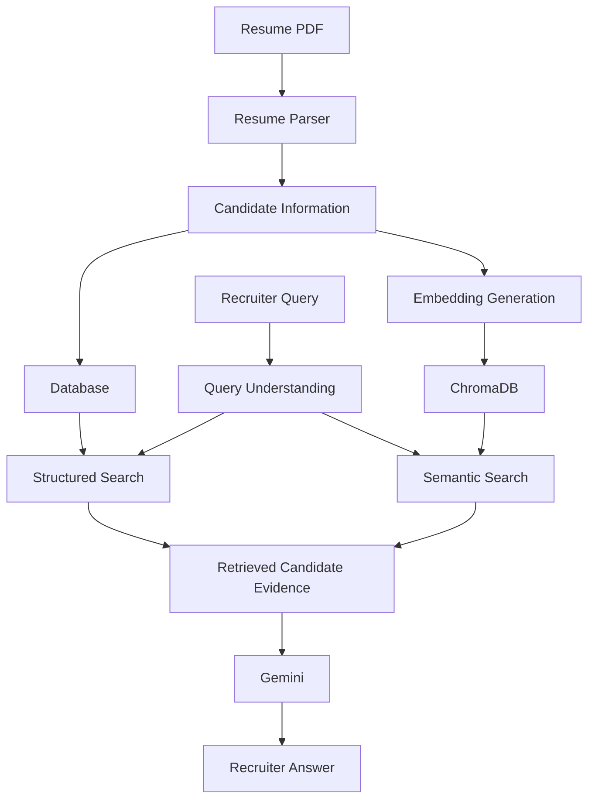

# RecruitIQ

> AI-powered candidate intelligence for modern recruitment.

RecruitIQ is an AI-powered recruitment system I'm building to make it easier for recruiters to search, understand, and match candidates.

Instead of manually going through resumes and relying only on keyword matching, RecruitIQ combines structured candidate data, semantic search, embeddings, and LLMs to help recruiters find relevant candidates and ask questions about their profiles using natural language.

## 🎥 Demo

[▶️ Watch the RecruitIQ Demo](https://drive.google.com/file/d/1KAiO-GLDjqvhLpakGRiNnScOch7ICy5l/view?usp=drive_link)

---

## 🚀 Features

- 📄 Resume parsing and candidate information extraction
- 👤 Candidate management
- 💼 Job requirement management
- 🤖 AI-powered candidate matching
- 🔍 Structured candidate search
- 🧠 Semantic candidate search using embeddings
- 💬 Natural-language recruiter enquiries
- 📚 Search across candidate skills, projects, experience, and education
- 🎯 AI responses grounded in retrieved candidate information

---

## 🧠 How It Works

RecruitIQ combines structured candidate data with semantic search to handle different types of recruiter queries.



The LLM is not treated as the source of truth.

RecruitIQ first retrieves relevant information from the candidate data and then uses Gemini to turn that information into a useful response.

This helps keep the answers grounded in the actual candidate data.

---

## 🔍 Structured Search + Semantic Search

One of the things I wanted to solve was that not every recruiter query should be handled in the same way.

### Structured Search

Used when the recruiter is looking for specific information.

Examples:

> Which candidates have worked with AWS?

> Which candidates have a bachelor's degree?

> Tell me about Karthik Menon's projects.

These queries can be answered using the structured candidate data.

### Semantic Search

Used when the meaning of the query matters more than an exact keyword.

Examples:

> Which candidates have experience building data pipelines?

> Which candidates have built projects related to retail sales?

Here, RecruitIQ uses embeddings and semantic similarity to find relevant candidate information.

This gives the system both precise filtering and more flexible meaning-based search.

---

## 💬 Example Queries

Recruiters can ask questions about the candidate database using normal language.

Some examples:

- Which candidates have experience building data pipelines?
- Which candidates have built projects related to retail sales?
- Which candidates have worked with AWS?
- Tell me about Karthik Menon's projects.
- Which candidates have a bachelor's degree?

The system first understands what the recruiter is asking, chooses the appropriate retrieval approach, finds the relevant candidate information, and then generates the final response from that retrieved evidence.

---

## 🛠️ Tech Stack

### Frontend

- React
- Vite
- JavaScript
- CSS

### Backend

- Python
- FastAPI
- SQLModel
- SQLite
- PostgreSQL

### AI & Search

- Google Gemini
- Embeddings
- ChromaDB
- Semantic Search
- Retrieval-Augmented Generation (RAG)

### Development & Deployment

- Git
- GitHub
- Railway

---

## 🏗️ Project Structure

```text
RecruitIQ/
│
├── backend/
│   ├── ...
│   └── ...
│
├── frontend/
│   ├── src/
│   │   ├── pages/
│   │   ├── App.jsx
│   │   └── ...
│   └── ...
│
├── screenshots/
│   ├── dashboard.png
│   ├── candidates.png
│   ├── matching.png
│   └── enquiry.png
│
└── README.md
```

---

## ⚙️ Running Locally

### 1. Clone the repository

```bash
git clone YOUR_REPOSITORY_URL
cd RecruitIQ
```

### 2. Start the backend

```bash
cd backend

pip install -r requirements.txt

uvicorn main:app --reload
```

The backend will run locally on:

`http://127.0.0.1:8000`

### 3. Start the frontend

Open another terminal:

```bash
cd frontend

npm install
npm run dev
```

The frontend will then be available through the Vite development server.

### 4. Environment Variables

Create a `.env` file in the backend directory and add the required API keys.

```env
GEMINI_API_KEY=your_api_key
```

---

## 🎯 Why I Built This

I wanted to build something beyond a simple chatbot or an application that just sends a prompt to an LLM.

RecruitIQ gave me a chance to work through the different parts of an actual AI application:

- Working with structured candidate data
- Extracting information from resumes
- Generating and using embeddings
- Working with a vector database
- Combining structured and semantic retrieval
- Designing an LLM-powered query layer
- Grounding AI responses in retrieved data
- Building a FastAPI backend
- Connecting the backend to a React frontend

A big part of the project has been figuring out where an LLM should be used and where it shouldn't.

---

## 📌 Current Status

🚧 **Active Development**

The core backend functionality for candidate parsing, candidate storage, matching, semantic retrieval, and natural-language enquiries is working.

The React frontend and deployment workflow are currently being developed and refined.

---

## 🔮 What's Next

- Improve the recruiter dashboard
- Improve the candidate and job management UI
- Add more detailed matching explanations
- Improve the enquiry experience
- Deploy a stable demo version
- Continue improving retrieval quality and evaluation

---

## 👨‍💻 About the Project

RecruitIQ is a project I'm building as part of my journey into AI engineering and AI application development.

The goal isn't just to make an LLM generate an answer.

It's to build the complete system around it — data, retrieval, AI, backend, frontend, and eventually deployment.

---

**Built with Python, FastAPI, React, ChromaDB, Gemini, and a lot of debugging.**